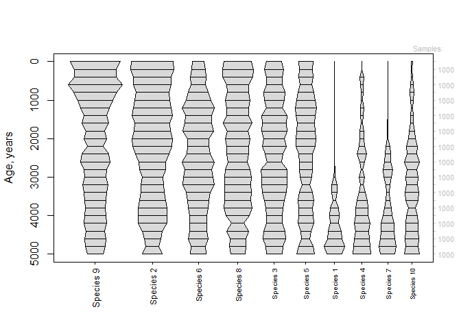

<!-- README.md is generated from README.Rmd. Please edit that file -->

# ecoDrift

<!-- badges: start -->

<!-- badges: end -->

Contains functions for modeling change in community composition with
Hubbell’s neutral theory.

## Installation

You can install the development version of ecoDrift from
[GitHub](https://github.com/) with:

``` r
# install.packages("devtools")
devtools::install_github("jgsaulsbury/ecoDrift")
```

## Example

Simulate and visualize a timeseries under neutral theory with incomplete
sampling:

``` r
library(ecoDrift)
J <- 50000 #50,000 individuals
nsp <- 10 #10 species
tslength <- 5000 #run for 5000 timesteps
every <- 200 #sample every 200 timesteps...
ss <- 1000 #...and sample 1,000 individuals (with replacement) when you do
ages <- seq(0,tslength,every)
set.seed(1)
X <- simNT(startingabs=rep(J/nsp,nsp),ts=ages,ss=1000)
plot_spindles(X$simulation,X$times)
```



Find the best-fit J for this simulated timeseries:

``` r
fitJ(occs=X$simulation,ages=X$times,CI=TRUE)
#> $loglik
#> [1] 499.2732
#> 
#> $J
#> [1] 42983.42
#> 
#> $CI
#> [1] 32696.11 56838.25
```
